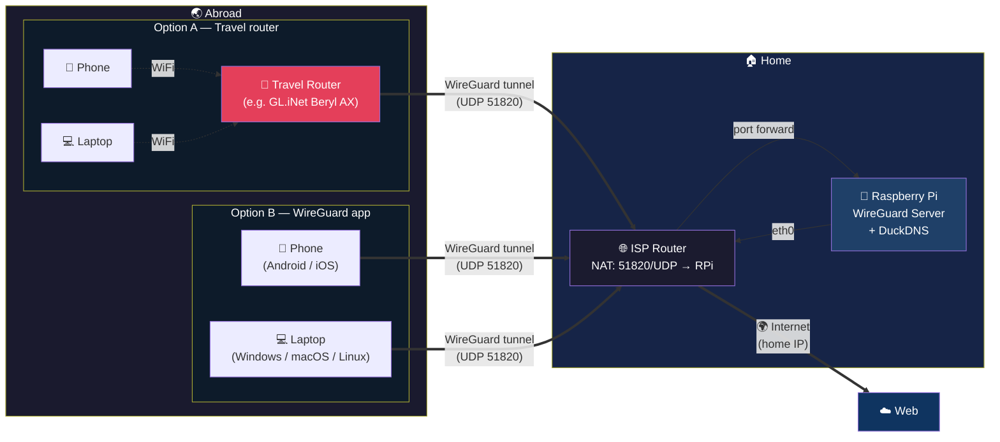

# Raspberry Pi as WireGuard VPN Exit Node

Turn a Raspberry Pi into a WireGuard VPN server so you can browse the internet
from your home IP — even when you're on the other side of the world.

> **Tested on Raspberry Pi 3B** with Raspberry Pi OS Lite 64-bit. Should work on any RPi 3B or newer running the same OS.

**Use case:** You're travelling abroad and some websites, streaming services, or apps
don't work the same way — or at all. This setup lets you route all your traffic through
your home IP. Your devices connect to the RPi via a WireGuard tunnel and everything
works as if you were at home.

## Why Not a Commercial VPN?

Because you're exiting through your own residential IP, not a shared datacenter IP:

- **No CAPTCHAs** — commercial VPNs share IPs across thousands of users, triggering anti-bot checks. Your home IP is clean.
- **No service blocks** — streaming platforms (Netflix, Disney+), banks, and other services actively block known VPN IP ranges. A residential IP isn't flagged.
- **Access your home network** — reach your NAS, cameras, printer, or smart home devices as if you were on your couch.
- **No subscription** — one-time hardware cost, no monthly fees.
- **No third party** — no VPN provider sees your traffic. You own the server, you control the logs.
- **Stable, unique IP** — always the same IP (your ISP box), which helps with services that check geographic consistency.

## Architecture



**How it works:**

1. The RPi sits at home, connected to your ISP router via ethernet
2. [DuckDNS](https://www.duckdns.org) keeps a public DNS name pointing to your home IP (updated every 5 min)
3. Your ISP router forwards port 51820/UDP to the RPi
4. Abroad, your devices connect to the RPi through a WireGuard tunnel — either:
   - **Option A:** via a travel router (e.g. GL.iNet Beryl AX) — all devices behind it are tunnelled automatically
   - **Option B:** via the [WireGuard app](https://www.wireguard.com/install/) installed directly on each device (Android, iOS, Windows, macOS, Linux)
5. All traffic exits through your home IP → you're subject to your home country's internet rules, not the local ones

## Prerequisites

| What | Details |
| ------ | --------- |
| **Raspberry Pi** | 3B or newer, with Raspberry Pi OS Lite 64-bit (fresh install) |
| **Network** | RPi connected via ethernet to your ISP router |
| **DuckDNS account** | Free — sign up at [duckdns.org](https://www.duckdns.org), create a subdomain, grab your token |
| **Router access** | Ability to set up a DHCP static lease + port forwarding (NAT/PAT) |
| **WireGuard client** | Any device or app: travel router, phone, laptop... |

## Quick Start

```bash
# 1. Clone the repo
git clone https://github.com/synthetiqgroup/rpi-wireguard-exit-node.git
cd rpi-wireguard-exit-node

# 2. Edit the configuration section at the top of the script
#    → Set your DuckDNS token, subdomain, and client profile name(s)
nano setup.sh

# 3. Run it (must be root, must be bash)
sudo bash setup.sh
```

The script is fully unattended — zero interactive prompts. It will:

- Install & configure everything (WireGuard, DuckDNS, fail2ban, iptables, cron...)
- Print each client `.conf` to the terminal — paste it into your WireGuard client
- Reboot at the end to verify everything starts cleanly

## After the Script

Two manual steps remain (the script reminds you):

1. **Router port forwarding** — forward `51820/UDP` and `2222/TCP` to the RPi's local IP
   *(router admin is often at `192.168.1.1` or `192.168.0.1` — check your router's docs)*

2. **Client config** — paste the generated `.conf` into your WireGuard client
   *(e.g. GL.iNet → VPN → WireGuard Client → Add Profiles → Manually)*

## What the Script Does

| Step | Description |
| ------ | ------------- |
| 1 | System update (`apt update` + `full-upgrade`) |
| 2 | Create dedicated VPN user with sudo (no password login) |
| 3 | Install dependencies (curl, iptables-persistent, fail2ban...) |
| 4 | Configure DuckDNS (dynamic DNS, 5-min cron update) |
| 5 | Enable IP forwarding |
| 6 | Install PiVPN / WireGuard (unattended) |
| 7 | Fix iptables NAT rule (PiVPN bug workaround) + persist rules |
| 8 | Create WireGuard client profile(s) |
| 9 | Configure fail2ban (progressive SSH banning, up to 24h) |
| 10 | Configure logrotate + cap journald at 100 MB |
| 11 | Schedule daily apt update + reboot at 3 AM |

> All configuration is in the top section of `setup.sh` — see the inline comments for details.

## Performance

Your actual speed is limited by the **slowest link** in the chain:

1. **Home ISP** upload speed (e.g. 400 Mbps fiber upload)
2. **Raspberry Pi** WireGuard throughput (see table below)
3. **Remote ISP** speed where you're connecting from
4. **Client device** WireGuard capability (e.g. GL.iNet Beryl AX caps at ~300 Mbps over ethernet)

| RPi model | Max WireGuard throughput   |
| --------- | -------------------------- |
| RPi 3B    | ~85 Mbps (USB2 shared bus) |
| RPi 4     | ~500 Mbps                  |
| RPi 5     | ~900 Mbps                  |

## Troubleshooting

| Problem | Cause | Fix |
| ------- | ----- | --- |
| `syntax error near unexpected token (` | Script was run with `sh` instead of `bash` | Use `sudo bash setup.sh` — arrays require bash |
| `iptables-persistent` shows interactive dialog | `debconf` prompts not pre-answered | Already handled in the script. If installing manually: run `echo iptables-persistent iptables-persistent/autosave_v4 boolean true \| debconf-set-selections` first |
| `pivpn add` prompts for IP interactively | Missing `-ip auto` flag | Already handled in the script, but if running manually: `pivpn add -n name -ip auto` |
| DuckDNS returns `KO` | Wrong token or subdomain | Double-check `DUCKDNS_TOKEN` and `DUCKDNS_DOMAIN` at [duckdns.org](https://www.duckdns.org) |
| PiVPN install fails | RPi hostname is too long | Keep hostname under 20 characters (`sudo hostnamectl set-hostname short-name`) |
| `pivpn add` refuses the profile name | Name exceeds 15 characters | WireGuard interface names are limited to 15 chars — use shorter names |
| Two devices share the same `.conf` | Only the last connected device works | Each profile has a unique key pair — **1 profile = 1 device at a time**. Create a separate profile per device. |
| VPN connected but no internet | MASQUERADE rule missing or wrong | The script auto-fixes this (step 7). If re-running manually: `pivpn debug` |
| Slow download, fast upload | ISP or mobile carrier throttling UDP | Test on a different network — this is not a tunnel issue |

## Disclaimer

This project is provided for **educational and legitimate personal use only**. You are solely responsible for how you use it. Make sure you comply with the laws and regulations of your country and any country you connect from. The author assumes no liability for misuse.

## License

MIT
